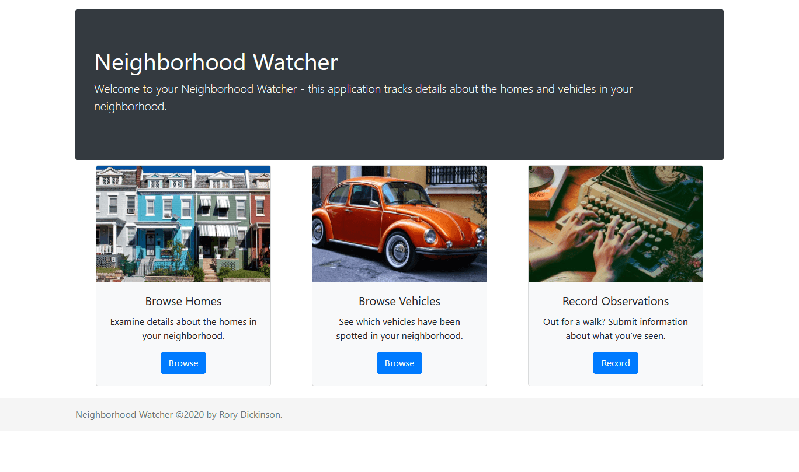
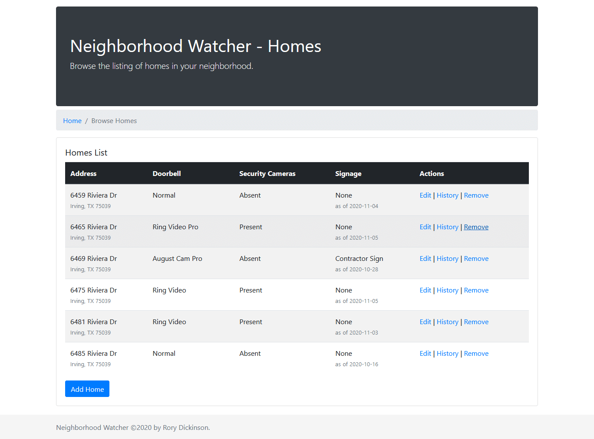
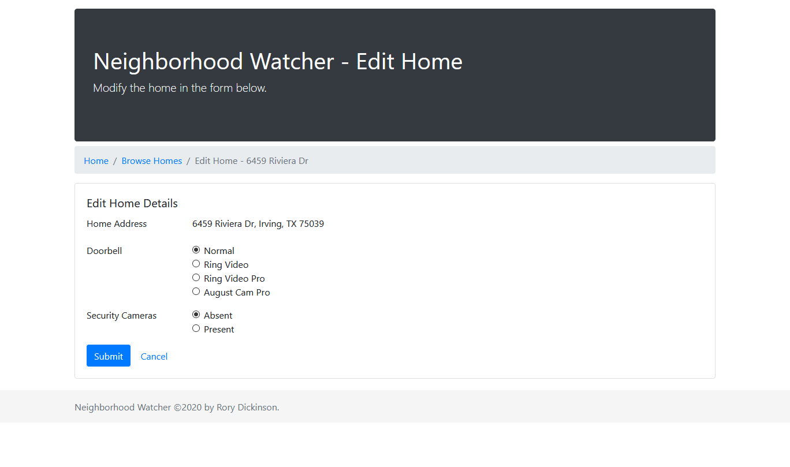
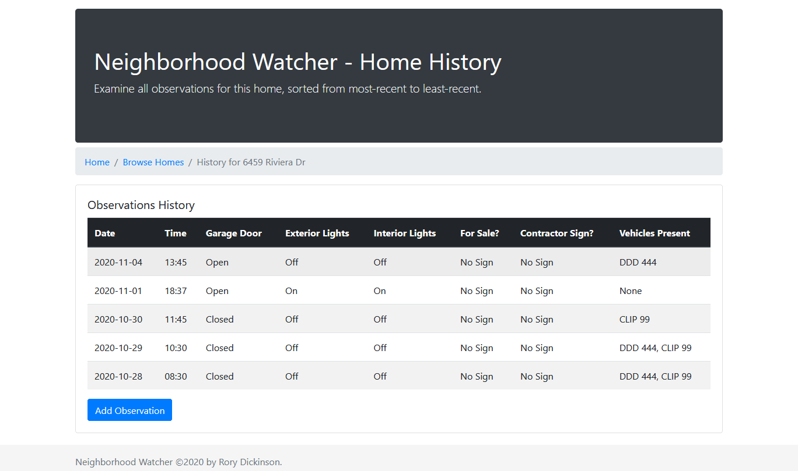
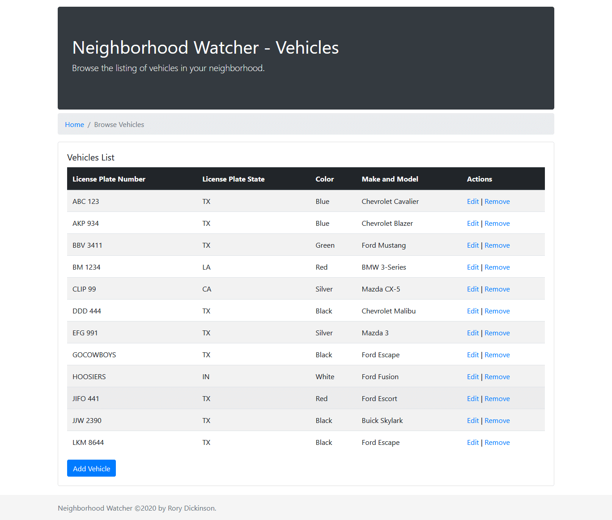
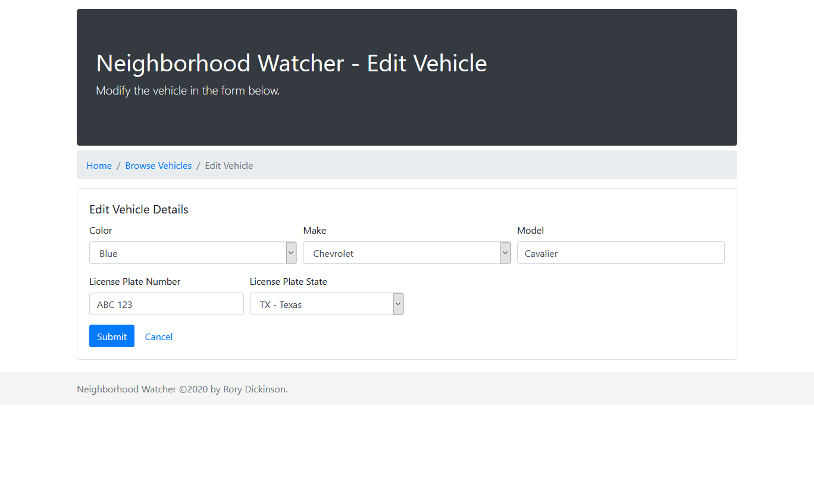
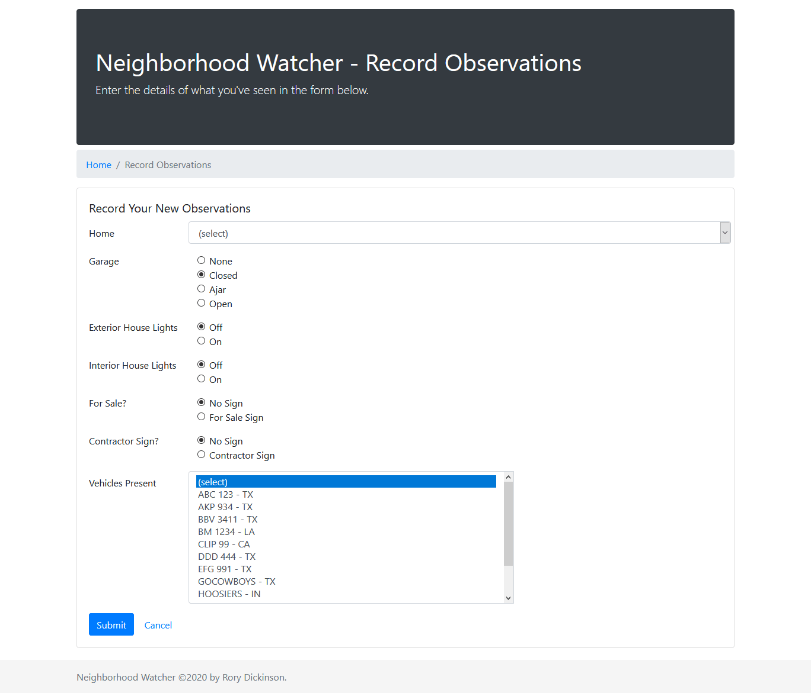
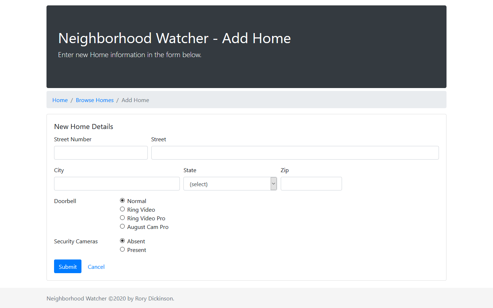

# Neighborhood Watcher

Neighborhood Watcher is a simple web application to help an individual makes notes on homes and vehicles in your local neighborhood.  My home had an attempted break-in several years ago, and ever since then I've thought about making something like this.  It's my submission for HacksAndCrafts 2020.

## Technologies Used

The back-end was made with Java and Spring Boot.  For now, I've hard-coded a set of dummy data into the application, so that I can focus a bit more on the front-end this time around.  The front-end itself was created in HTML/CSS using [Thymeleaf](https://www.thymeleaf.org/) and [Bootstrap](https://getbootstrap.com/).

## Attribution

House photos harvested from [pexels.com](https://www.pexels.com) (can modify and use for free), edited at [pixlr.com](https://pixlr.com/x/), and then compressed at [tinypng.com](https://tinypng.com/).

## Screenshots

